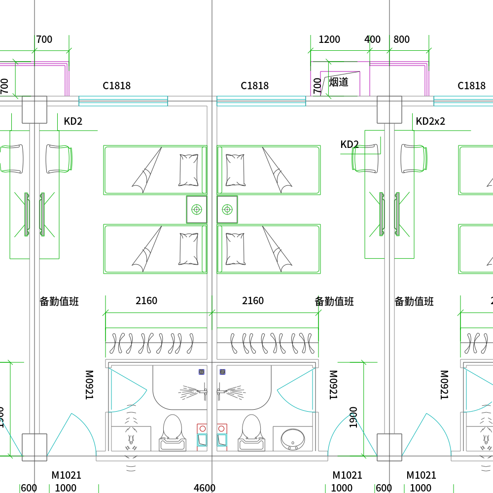
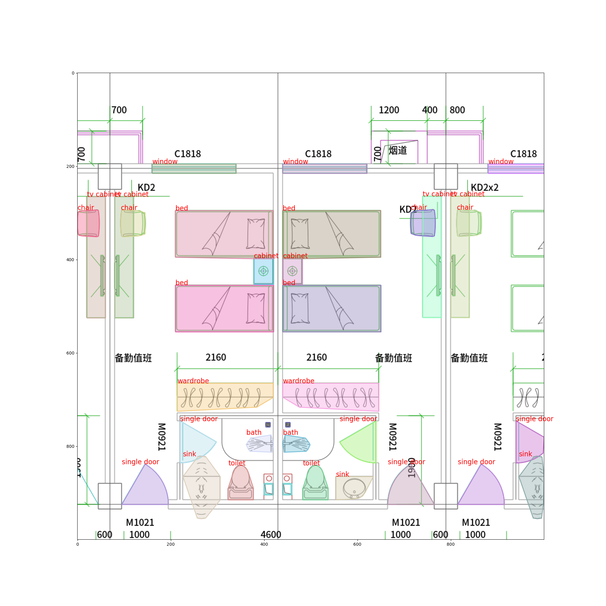

# FloorPlanCAD Dataset

## Verdict:

> Not that useful:
1. Floor plans not that realistic
1. Not sure if they include room segmentation in labels
1. Floor plans include furniture items
1. Labels manually generated from svg files, therefore not in COCO format.
1. Labels difficult to extract from svgs
    ```svg
    <?xml version="1.0" encoding="utf-8"?>
    <svg style="background-color: #000;" version="1.1" viewBox="0 0 100.0 100.0" xmlns="http://www.w3.org/2000/svg" xmlns:ns1="http://www.inkscape.org/namespaces/inkscape">
    <g id="layer0" ns1:groupmode="layer" ns1:label="0">
        <path d="M 73.00011150000003,14.49600199999999 L 73.00011150000003,19.500001999999995" fill="none" stroke="rgb(178,0,178)" stroke-width="0.1"/>
    ...
        </g>
    </svg>
    ```
1. Project deprecated

## Examples:
* PNG image:
    
* Annotated Image (coco format):
    